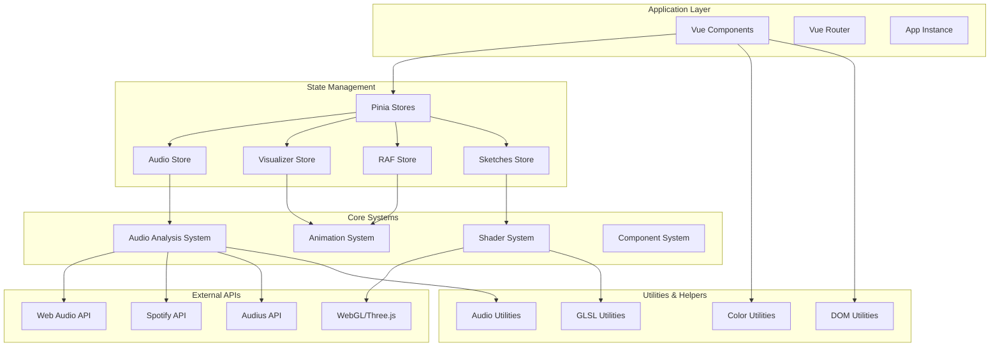
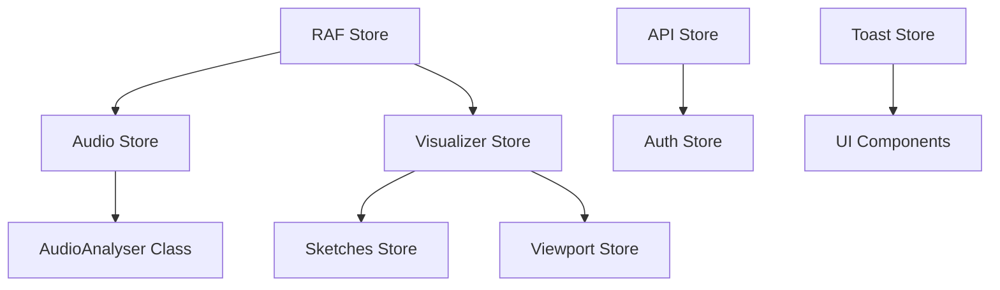
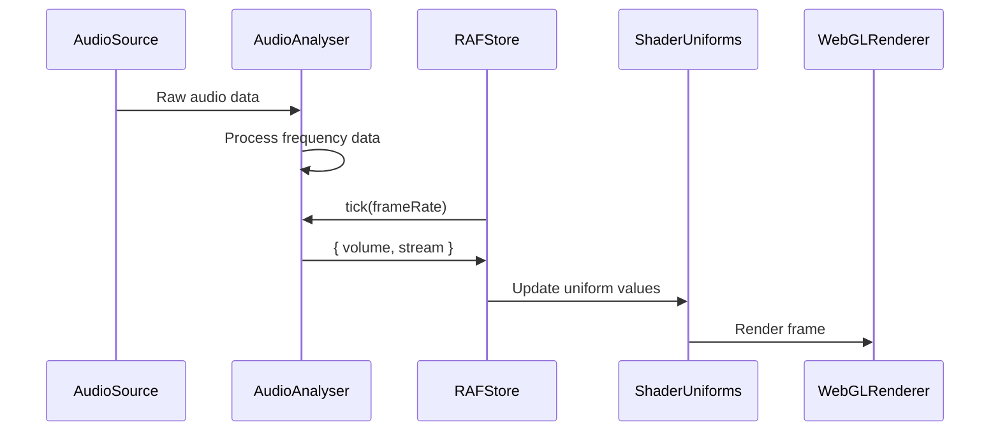
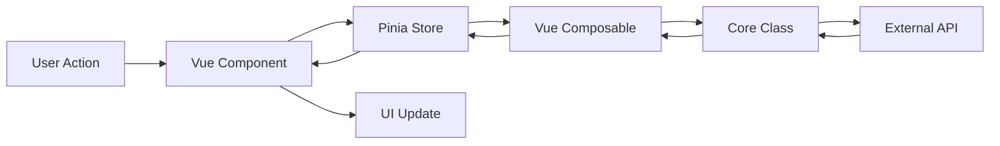

# Architecture Guide

This document provides a comprehensive overview of the `@wearesage/vue` library architecture, design patterns, and system organization.

## Table of Contents

- [Overview](#overview)
- [Core Technologies](#core-technologies)
- [System Architecture](#system-architecture)
- [Project Structure](#project-structure)
- [Core Systems](#core-systems)
- [Design Patterns](#design-patterns)
- [Data Flow](#data-flow)
- [Performance Considerations](#performance-considerations)
- [Extension Points](#extension-points)

## Overview

`@wearesage/vue` is architected as a modular, performance-optimized multimedia library that seamlessly integrates audio processing, 3D graphics, and reactive UI components. The library follows Vue 3's composition API patterns while providing specialized systems for creative coding and multimedia applications.

### Architectural Principles

1. **Modularity** - Domain-separated components and utilities
2. **Performance** - Optimized rendering and animation systems
3. **Reactivity** - Vue's reactive system integrated with real-time audio/visual data
4. **Extensibility** - Clear extension points for custom functionality
5. **Developer Experience** - TypeScript, auto-imports, and comprehensive tooling

## Core Technologies

### Frontend Stack
- **Vue 3** - Composition API with `<script setup>` syntax
- **TypeScript** - Strict typing with comprehensive declarations
- **Pinia** - Centralized state management
- **VueUse** - Composition utilities and reactive primitives

### Graphics & Animation
- **Three.js** - WebGL 3D graphics engine
- **TresJS** - Vue 3 Three.js integration layer  
- **GLSL** - Custom shader development with utility injection
- **RequestAnimationFrame** - Custom animation management system

### Audio Processing
- **Web Audio API** - Real-time audio analysis and processing
- **AudioContext** - Low-level audio manipulation
- **Custom AudioAnalyser** - Specialized audio analysis class

### Development Tools
- **Vite** - Build system and development server
- **tsup** - TypeScript compilation and bundling
- **CodeMirror** - In-browser code editing with GLSL support
- **Auto-imports** - Automatic component and utility imports

## System Architecture



## Project Structure

### Directory Organization

```
src/
├── assets/              # Static assets (SVG icons)
├── classes/             # Core classes and business logic
│   ├── AudioAnalyser.ts # Audio processing class
│   └── index.ts         # Class exports
├── client.ts            # Main library entry point
├── components/          # Vue components by domain
│   ├── audius/         # Music platform components
│   ├── chat/           # Chat and messaging
│   ├── chess/          # Chess game components
│   ├── common/         # Reusable UI components
│   ├── forms/          # Form controls and inputs
│   ├── home/           # Landing page components
│   ├── layout/         # Layout and grid systems
│   └── webgl/          # WebGL and shader components
├── composables/         # Vue composition functions
├── constants/           # Static constants and configurations
├── data/               # Static data files and datasets
│   ├── geo/            # Geographic data
│   ├── music/          # Music metadata
│   └── shaders/        # Shader collections
├── stores/             # Pinia state management
├── styles/             # SCSS styling system
│   ├── functions/      # SCSS functions
│   ├── global/         # Global styles
│   ├── mixins/         # SCSS mixins
│   └── theme/          # Theme variables
├── types/              # TypeScript type definitions
├── util/               # Utility functions by domain
└── vite.ts             # Vite configuration
```

### Component Organization Pattern

Components follow a domain-driven organization:

```typescript
// Each domain has its own index.ts for exports
export { default as Button } from "./Button.vue";
export { default as Icon } from "./Icon.vue";

// Components are self-contained with co-located styles
<template><!-- Template --></template>
<script setup lang="ts">/* Logic */</script>
<style lang="scss" scoped>/* Styles */</style>
```

## Core Systems

### 1. Audio Analysis System

The audio system is built around the `AudioAnalyser` class and provides real-time audio processing.

#### Architecture
```typescript
AudioAnalyser {
  - config: AudioAnalyserConfig
  - state: AudioAnalyserState
  - ctx: AudioContext
  - analyser: AnalyserNode
  - source: MediaElementAudioSourceNode | MediaStreamAudioSourceNode
  
  + initialize(source)
  + tick(frameRate): { volume, stream }
  + destroy()
}
```

#### Integration Points
- **RAF System**: Audio values updated via animation loop
- **Pinia Stores**: Audio state managed in reactive stores
- **Shader System**: Audio values passed as uniforms to shaders
- **Component System**: Audio data drives visual component behavior

### 2. Animation System (RAF)

Custom RequestAnimationFrame management system for performance optimization.

#### Architecture
```typescript
RAFStore {
  - queue: Animation[]        // Timed animations
  - map: Record<id, Animation> // Continuous animations
  - frameRate: number         // Current FPS
  - time: number             // Current timestamp
  
  + add(tick, animation): Promise<void>
  + remove(id): void
  + start(): void
  + stop(): void
}
```

#### Features
- **Automatic Lifecycle**: Starts/stops RAF loop based on active animations
- **Performance Monitoring**: Real-time frame rate calculation
- **Promise Support**: Timed animations return promises
- **Easing Functions**: Built-in easing with custom function support

### 3. Shader System

WebGL shader development and rendering system built on Three.js.

#### Components
- **Sketch**: Main WebGL canvas component
- **SketchMesh**: Three.js mesh with shader material
- **GLSLEditor**: CodeMirror-based shader editor
- **ShaderScroll**: Gallery component for shader collections

#### GLSL Utility Injection
```glsl
// Utilities are automatically injected into shaders
vec2 uv = k_uv();                    // Normalized coordinates
vec3 color = k_rainbow(progress);    // Rainbow colors  
vec2 rotated = k_rotate2d(angle);    // 2D rotation
vec4 orb = k_orb(uv, size, pos);     // Orb rendering
```

### 4. State Management Architecture

Pinia stores organized by domain with reactive composition:

```typescript
// Store Pattern
export const useStoreName = defineStore("name", () => {
  // State
  const state = ref(initialValue);
  
  // Computed
  const derived = computed(() => transform(state.value));
  
  // Actions  
  function action() {
    state.value = newValue;
  }
  
  return { state, derived, action };
});
```

#### Store Dependencies


## Design Patterns

### 1. Composition Pattern

Heavy use of Vue 3's composition API for reusable logic:

```typescript
// Composable pattern
export function useAudioAnalyser() {
  const instance = shallowRef<AudioAnalyser | null>(null);
  const volume = ref(1);
  const stream = ref(0);
  
  function initialize(element: HTMLAudioElement) {
    // Setup logic
  }
  
  return { instance, volume, stream, initialize };
}
```

### 2. Factory Pattern

The `createApp` function acts as an application factory:

```typescript
export function createApp(App: any, routes: any, target = "#app") {
  const app = createVueApp(App);
  app.use(createPinia());
  app.use(createRouter({ history: createWebHistory(), routes }));
  app.use(Tres);
  return app.mount(target);
}
```

### 3. Observer Pattern

Reactive systems with watchers for cross-system communication:

```typescript
// Audio changes trigger visual updates
watch(() => audio.volume, (newVolume) => {
  uniforms.u_volume.value = newVolume;
});
```

### 4. Strategy Pattern

Multiple audio source strategies:

```typescript
interface AudioSource {
  initialize(): Promise<void>;
  getVolume(): number;
  destroy(): void;
}

class SpotifySource implements AudioSource { /* ... */ }
class MicrophoneSource implements AudioSource { /* ... */ }
class FileSource implements AudioSource { /* ... */ }
```

## Data Flow

### Audio-Visual Pipeline



### Component Communication



## Performance Considerations

### 1. Reactive Optimization

- **Shallow Refs**: Used for complex objects (AudioAnalyser, Three.js objects)
- **Computed Properties**: Efficient derivations with automatic caching
- **Selective Reactivity**: Only necessary data made reactive

```typescript
// Performance-optimized patterns
const audioAnalyser = shallowRef(new AudioAnalyser()); // Don't track internals
const uniforms = computed(() => ({ /* derived values */ })); // Cached
const volume = ref(0); // Simple reactive value
```

### 2. Animation Performance

- **RAF Management**: Automatic start/stop prevents unnecessary processing
- **Frame Rate Monitoring**: Real-time performance feedback
- **Batch Operations**: Multiple animations processed in single RAF cycle

### 3. WebGL Optimization

- **Uniform Caching**: Shader uniforms only updated when values change
- **Geometry Reuse**: Shared geometries across shader instances
- **Texture Management**: Efficient texture loading and disposal

### 4. Memory Management

- **Cleanup Functions**: Proper disposal of audio contexts and WebGL resources
- **Event Listener Cleanup**: Automatic cleanup on component unmount
- **Store Reset**: Store reset functionality for testing and cleanup

## Extension Points

### 1. Custom Components

Follow established patterns for new components:

```typescript
// Component development pattern
<template>
  <div class="my-component">
    <slot />
  </div>
</template>

<script setup lang="ts">
interface Props {
  // Define props with defaults
}

const props = withDefaults(defineProps<Props>(), {
  // Default values
});

const emit = defineEmits<{
  // Define events
}>();
</script>

<style lang="scss" scoped>
.my-component {
  @include existing-mixins;
  // Follow established patterns
}
</style>
```

### 2. Custom Stores

Extend state management with domain-specific stores:

```typescript
export const useCustomStore = defineStore("custom", () => {
  // Follow composition pattern
  const state = ref(initialState);
  const computed = computed(() => derivedState);
  function actions() { /* mutations */ }
  
  return { state, computed, actions };
});
```

### 3. Utility Extensions

Add domain-specific utilities:

```typescript
// src/util/custom.ts
export function customUtility(input: InputType): OutputType {
  // Implementation
}

// Export in src/util/index.ts
export * from "./custom";
```

### 4. Audio Source Extensions

Add new audio input sources:

```typescript
class CustomAudioSource {
  async initialize(): Promise<void> {
    // Custom source setup
  }
  
  getVolume(): number {
    // Volume calculation
  }
  
  destroy(): void {
    // Cleanup
  }
}
```

### 5. GLSL Function Extensions

Add custom shader utilities:

```typescript
// src/constants/glsl-util.ts
export const k_custom = /*glsl*/ `
vec3 k_custom(vec2 uv, float param) {
  // Custom GLSL function
  return vec3(uv, param);
}
`;
```

## Conclusion

The `@wearesage/vue` architecture prioritizes modularity, performance, and developer experience while providing powerful multimedia capabilities. The system's reactive foundation, combined with specialized audio and graphics processing, creates a robust platform for creative applications.

Key architectural strengths:
- **Separation of Concerns**: Clear domain boundaries
- **Performance Optimization**: Efficient animation and rendering systems  
- **Extensibility**: Multiple extension points for customization
- **Developer Experience**: TypeScript, auto-imports, and comprehensive tooling
- **Reactive Integration**: Seamless Vue.js integration with real-time data

This architecture supports both simple use cases (basic audio visualization) and complex applications (full multimedia development environments) while maintaining performance and code organization.