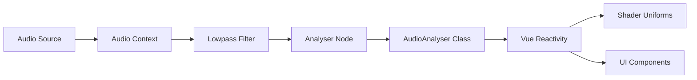

# Audio System Guide

This document provides comprehensive documentation for the audio analysis and processing system in `@wearesage/vue`.

## Table of Contents

- [Overview](#overview)
- [AudioAnalyser Class](#audioanalyser-class)
- [Audio Sources](#audio-sources)
- [Composables](#composables)
- [Stores](#stores)
- [Audio-Visual Synchronization](#audio-visual-synchronization)
- [Performance Optimization](#performance-optimization)
- [Advanced Usage](#advanced-usage)
- [Troubleshooting](#troubleshooting)

## Overview

The audio system in `@wearesage/vue` provides real-time audio analysis capabilities for creating responsive visual experiences. Built around the Web Audio API, it supports multiple audio sources and seamlessly integrates with Vue's reactivity system.

### Key Features

- **Real-time Analysis** - Live frequency and volume analysis
- **Multiple Sources** - Microphone, audio files, Spotify, radio streams
- **Vue Integration** - Reactive audio data with composables and stores
- **Performance Optimized** - Efficient processing with RAF integration
- **WebGL Integration** - Direct shader uniform updates

### Audio Processing Pipeline



## AudioAnalyser Class

The `AudioAnalyser` class is the core of the audio system, providing a high-level interface to Web Audio API functionality.

### Class Architecture

```typescript
class AudioAnalyser {
  public config: AudioAnalyserConfig;
  public state: AudioAnalyserState;
  private ctx?: AudioContext;
  private analyser?: AnalyserNode;
  private filter?: BiquadFilterNode;
  private analyserBuffer?: Uint8Array;
  private volumeBuffer: number[];
  private source?: MediaElementAudioSourceNode | MediaStreamAudioSourceNode;
}
```

### Configuration

```typescript
interface AudioAnalyserConfig {
  bitDepth: number;                    // FFT size (default: 1024)
  definitions: AudioStreamDefinitions; // Analysis parameters
  meyda: boolean;                      // Enable Meyda features (unused)
  lowpass: {
    frequency: number;                 // Filter frequency (default: 2000Hz)
    Q: number;                        // Filter Q factor (default: 0.5)
  };
}

interface AudioAnalyserState {
  initialized: boolean;
  volume: number;                      // Current volume (0-1)
  stream: number;                     // Cumulative stream value
  features: any;                      // Future: advanced audio features
  note: string | null;                // Future: pitch detection
  source: "microphone" | "audio" | "spotify" | null;
  microphone: MediaStream | null;
  mediaElementSource: MediaElementAudioSourceNode | null;
  mediaStreamSource: MediaStreamAudioSourceNode | null;
  getSpotifyVolume: () => number;
}
```

### Initialization

```typescript
// Initialize with audio element
const analyser = new AudioAnalyser({ 
  bitDepth: 1024,
  definitions: [[2.5, 0.09]], // [reference_duration, sample_duration] in seconds
  lowpass: { frequency: 2000, Q: 0.5 }
});

await analyser.initialize({ 
  element: audioElement 
});

// Initialize with microphone
await analyser.initialize({ 
  microphone: true 
});

// Initialize with Spotify (volume-only mode)
await analyser.initialize({ 
  spotify: true 
});
```

### Real-time Processing

The `tick()` method processes audio data and returns analysis results:

```typescript
const result = analyser.tick(frameRate);
// Returns: { volume: number, stream: number }
```

#### Volume Calculation Algorithm

```typescript
// 1. Get frequency data from analyser node
analyser.getByteFrequencyData(analyserBuffer);

// 2. Calculate raw volume (average of all frequencies)
let rawVolume = 0;
for (let i = 0; i < bufferLength; i++) {
  rawVolume += analyserBuffer[i];
}
rawVolume = rawVolume / bufferLength;

// 3. Apply reference scaling and smoothing
const [reference, sample] = sampleVolume(definitions);
const scaledVolume = scaleLinear([min, reference], [0, 1])(sample);

// 4. Apply power curve for perceptual scaling
const finalVolume = Math.pow(scaledVolume, 1.5) / 2;
```

#### Stream Value

The stream value provides a cumulative audio-driven parameter perfect for animations:

```typescript
// Stream accumulates over time based on volume
stream += Math.pow(rawVolume, 0.75) / 10;
```

### Cleanup

```typescript
await analyser.destroy();
// - Stops microphone tracks
// - Disconnects audio nodes
// - Closes audio context
```

## Audio Sources

The system supports multiple audio input sources with automatic switching:

### 1. Audio Element Source

For playing audio files or streams:

```typescript
const audioElement = document.querySelector('audio');
await analyser.initialize({ element: audioElement });
```

**Features:**
- Full frequency analysis
- Playback control through audio element
- Supports local files and remote URLs

### 2. Microphone Source

For real-time microphone input:

```typescript
await analyser.initialize({ microphone: true });
```

**Features:**
- Real-time input analysis
- Automatic permission handling
- No audio output (analysis only)

**Permission Handling:**
```typescript
// Browser will prompt for microphone permission
navigator.mediaDevices.getUserMedia({ audio: true, video: false })
```

### 3. Spotify Integration

For Spotify Web Playback SDK integration:

```typescript
await analyser.initialize({ 
  spotify: true,
  getSpotifyVolume: () => spotifyPlayer.getVolume()
});
```

**Features:**
- Volume-only analysis (no frequency data)
- Requires Spotify Web Playbook SDK
- Custom volume function integration

### 4. Radio Streams

Via audio element with streaming URLs:

```typescript
audioElement.src = 'https://radiostream.example.com/stream';
await analyser.initialize({ element: audioElement });
```

## Composables

### useAudioAnalyser

The primary composable for audio analysis integration:

```typescript
import { useAudioAnalyser } from '@wearesage/vue/composables';

const {
  instance,     // AudioAnalyser instance (shallowRef)
  initialize,   // Initialize function
  stream,       // Reactive stream value
  volume,       // Reactive volume value
  time,         // Current RAF time
  cleanup,      // Cleanup function
  initialized   // Initialization state
} = useAudioAnalyser();
```

#### Usage Example

```vue
<script setup>
import { useAudioAnalyser } from '@wearesage/vue/composables';

const { volume, stream, initialize } = useAudioAnalyser();

// Initialize with audio element
const audioRef = ref();
onMounted(() => {
  initialize(audioRef.value);
});

// Use in shader uniforms
const uniforms = computed(() => ({
  u_volume: { value: volume.value },
  u_stream: { value: stream.value }
}));
</script>

<template>
  <audio ref="audioRef" src="/audio/track.mp3" />
  <Sketch :uniforms="uniforms" :shader="fragmentShader" />
</template>
```

### useAudioElement

Helper composable for HTML audio element management:

```typescript
import { useAudioElement } from '@wearesage/vue/composables';

const {
  element,    // Audio element ref
  playing,    // Playback state
  play,       // Play function
  pause,      // Pause function
  toggle      // Toggle playback
} = useAudioElement(src, onLoadCallback);
```

### useAppliedVolume

Advanced volume processing composable:

```typescript
import { useAppliedVolume } from '@wearesage/vue/composables';

const {
  appliedVolume,  // Processed volume value
  config         // Volume processing configuration
} = useAppliedVolume(rawVolume, options);
```

## Stores

### Audio Store

Basic audio playback with built-in AudioAnalyser integration:

```typescript
import { useAudio } from '@wearesage/vue/stores';

const audio = useAudio();

// Properties
audio.element      // Audio element
audio.src          // Audio source URL
audio.volume       // Analyzed volume
audio.stream       // Analyzed stream
audio.playing      // Playback state
audio.initialized  // Analysis state

// Methods
audio.play()       // Start playback
audio.pause()      // Pause playback
audio.toggle()     // Toggle playback
```

### Visualizer Store

Advanced audio visualization store with multiple sources:

```typescript
import { useVisualizer } from '@wearesage/vue/stores';

const visualizer = useVisualizer();

// Audio source management
visualizer.source          // Current audio source
visualizer.sourceIcon      // Source icon name
visualizer.selectSource(source)  // Switch audio source

// Analysis data
visualizer.volume          // Current volume
visualizer.stream          // Current stream
visualizer.initialize      // Initialize function

// UI state
visualizer.showSources     // Source selector visibility
visualizer.showEditor      // Editor visibility
visualizer.showCustomize   // Customization panel
```

#### Audio Source Types

```typescript
type AudioSource = "SPOTIFY" | "AUDIUS" | "MICROPHONE" | "RADIO_PARADISE" | "KEXP" | "FILE";

const AudioSourceIcons = {
  SPOTIFY: "spotify",
  AUDIUS: "audius", 
  MICROPHONE: "microphone",
  RADIO_PARADISE: "radio-paradise",
  KEXP: "kexp",
  FILE: "upload"
};
```

## Audio-Visual Synchronization

### RAF Integration

Audio analysis is integrated with the RequestAnimationFrame system for smooth synchronization:

```typescript
// AudioAnalyser updates are called via RAF
raf.add(() => {
  const values = audioAnalyser.tick(raf.frameRate);
  volume.value = values.volume;
  stream.value = values.stream;
}, { id: 'audio' });
```

### Shader Integration

Audio values are automatically passed to shaders as uniforms:

```vue
<script setup>
const { volume, stream } = useAudioAnalyser();

const uniforms = computed(() => ({
  u_volume: { value: volume.value },
  u_stream: { value: stream.value },
  u_time: { value: Date.now() * 0.001 }
}));
</script>

<template>
  <Sketch :uniforms="uniforms" :shader="audioReactiveShader" />
</template>
```

### Example Audio-Reactive Shader

```glsl
uniform float u_volume;
uniform float u_stream;
uniform float u_time;

void main() {
  vec2 uv = k_uv();
  
  // Volume affects brightness
  float brightness = u_volume * 2.0;
  
  // Stream affects animation offset
  float offset = u_stream * 0.1;
  
  // Create audio-reactive visual
  vec3 color = k_rainbow(length(uv) + offset, 1.0, u_time);
  color *= brightness;
  
  gl_FragColor = vec4(color, 1.0);
}
```

### Component Reactivity

Audio values automatically trigger Vue component updates:

```vue
<script setup>
const { volume } = useAudioAnalyser();

// Reactive CSS variables
const audioStyle = computed(() => ({
  '--volume': volume.value,
  '--scale': 1 + volume.value * 0.5
}));
</script>

<template>
  <div class="audio-reactive" :style="audioStyle">
    <div class="volume-bar" />
  </div>
</template>

<style scoped>
.volume-bar {
  transform: scale(var(--scale));
  opacity: var(--volume);
}
</style>
```

## Performance Optimization

### Efficient Processing

1. **Shared AudioContext**: Single audio context across all instances
2. **Buffer Reuse**: Typed arrays reused across analysis cycles
3. **Selective Updates**: Only update when audio is playing
4. **RAF Integration**: Analysis synchronized with rendering

### Memory Management

```typescript
// Proper cleanup prevents memory leaks
onBeforeUnmount(() => {
  audioAnalyser.destroy();
  raf.remove('audio');
});
```

### Performance Monitoring

```typescript
// Monitor frame rate impact
const raf = useRAF();
watch(() => raf.frameRate, (fps) => {
  if (fps < 30) {
    console.warn('Audio analysis affecting frame rate');
  }
});
```

## Advanced Usage

### Custom Audio Processing

Extend AudioAnalyser for custom analysis:

```typescript
class CustomAudioAnalyser extends AudioAnalyser {
  async initialize(options) {
    await super.initialize(options);
    
    // Add custom processing nodes
    this.customFilter = this.ctx.createBiquadFilter();
    this.customFilter.type = 'highpass';
    this.source.connect(this.customFilter);
    this.customFilter.connect(this.analyser);
  }
  
  tick(frameRate) {
    const baseResult = super.tick(frameRate);
    
    // Add custom analysis
    const customFeature = this.analyzeCustomFeature();
    
    return {
      ...baseResult,
      customFeature
    };
  }
}
```

### Multiple Analyser Instances

For complex applications requiring multiple analysis streams:

```typescript
const bassAnalyser = new AudioAnalyser({
  lowpass: { frequency: 250, Q: 1.0 }  // Bass range
});

const trebleAnalyser = new AudioAnalyser({
  lowpass: { frequency: 8000, Q: 0.3 }  // Full range
});

// Initialize both with same source
await bassAnalyser.initialize({ element: audioElement });
await trebleAnalyser.initialize({ element: audioElement });
```

### Real-time Parameter Control

Dynamic configuration updates:

```typescript
// Update analysis parameters
audioAnalyser.definitions = [[1.0, 0.05]]; // Faster response

// Update filter settings
audioAnalyser.filter.frequency.value = 1000;
audioAnalyser.filter.Q.value = 2.0;
```

## Troubleshooting

### Common Issues

#### No Audio Analysis
```typescript
// Check initialization
if (!audioAnalyser.state.initialized) {
  console.error('AudioAnalyser not initialized');
}

// Check audio context state
if (audioAnalyser.ctx?.state !== 'running') {
  await audioAnalyser.ctx?.resume();
}
```

#### Microphone Permission Denied
```typescript
try {
  await audioAnalyser.initialize({ microphone: true });
} catch (error) {
  if (error.name === 'NotAllowedError') {
    console.error('Microphone permission denied');
    // Fallback to file input
  }
}
```

#### Performance Issues
```typescript
// Reduce FFT size for better performance
const analyser = new AudioAnalyser({
  bitDepth: 512  // Smaller FFT size
});

// Monitor processing time
const startTime = performance.now();
audioAnalyser.tick(60);
const processingTime = performance.now() - startTime;
```

### Browser Compatibility

| Feature | Chrome | Firefox | Safari | Edge |
|---------|--------|---------|---------|------|
| AudioContext | ✅ | ✅ | ✅ | ✅ |
| MediaStream | ✅ | ✅ | ✅ | ✅ |
| Web Audio API | ✅ | ✅ | ✅ | ✅ |

### Debug Mode

Enable detailed logging:

```typescript
const audioAnalyser = new AudioAnalyser({
  debug: true  // Enable console logging
});

// Manual debugging
console.log('Audio State:', audioAnalyser.state);
console.log('Raw Volume:', audioAnalyser.rawVolume);
```

## Integration Examples

### React-style Audio Visualizer

```vue
<script setup>
import { useAudioAnalyser } from '@wearesage/vue/composables';

const { volume, stream, initialize } = useAudioAnalyser();

const visualizerStyle = computed(() => ({
  transform: `scale(${1 + volume.value})`,
  filter: `hue-rotate(${stream.value * 360}deg)`
}));
</script>

<template>
  <div class="visualizer" :style="visualizerStyle">
    <div class="audio-bars">
      <div 
        v-for="i in 10" 
        :key="i"
        class="bar"
        :style="{ height: `${volume.value * 100}%` }"
      />
    </div>
  </div>
</template>
```

### Multi-source Audio Controller

```vue
<script setup>
import { useVisualizer } from '@wearesage/vue/stores';

const visualizer = useVisualizer();

const sources = [
  { id: 'MICROPHONE', label: 'Microphone', icon: 'microphone' },
  { id: 'SPOTIFY', label: 'Spotify', icon: 'spotify' },
  { id: 'FILE', label: 'Upload File', icon: 'upload' }
];
</script>

<template>
  <div class="audio-controller">
    <div class="source-selector">
      <button 
        v-for="source in sources"
        :key="source.id"
        @click="visualizer.selectSource(source.id)"
        :class="{ active: visualizer.source === source.id }"
      >
        <Icon :name="source.icon" />
        {{ source.label }}
      </button>
    </div>
    
    <div class="audio-display">
      Volume: {{ Math.round(visualizer.volume * 100) }}%
      Stream: {{ visualizer.stream.toFixed(2) }}
    </div>
  </div>
</template>
```

This comprehensive audio system provides the foundation for creating sophisticated audio-reactive applications with Vue 3, offering both simplicity for basic use cases and powerful customization for advanced requirements.