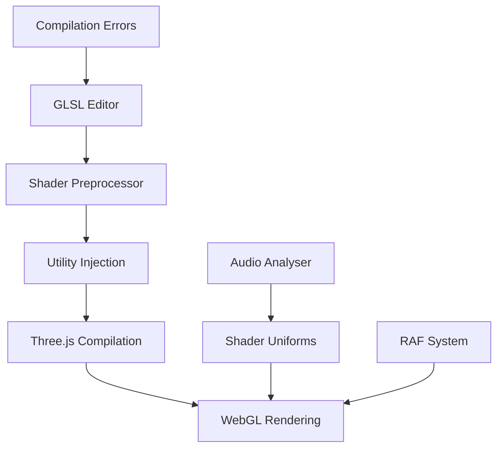

# Shader Development Guide

Comprehensive guide to shader development and WebGL programming with `@wearesage/vue`.

## Table of Contents

- [Overview](#overview)
- [Development Environment](#development-environment)
- [Shader Architecture](#shader-architecture)
- [GLSL Utilities](#glsl-utilities)
- [Audio Integration](#audio-integration)
- [Development Workflow](#development-workflow)
- [Advanced Techniques](#advanced-techniques)
- [Performance Optimization](#performance-optimization)
- [Troubleshooting](#troubleshooting)

## Overview

The `@wearesage/vue` shader development system provides a complete environment for creating interactive WebGL shaders with real-time audio integration. Built on Three.js and TresJS, it offers a modern approach to creative coding with Vue 3's reactive system.

### Key Features

- **Live Editor** - CodeMirror-based GLSL editor with syntax highlighting
- **Hot Reload** - Real-time shader compilation and preview
- **Audio Integration** - Direct audio analysis data in shaders
- **Utility Injection** - Automatic injection of common GLSL functions
- **Error Handling** - Real-time compilation error reporting
- **Study System** - Organized approach to shader development and iteration

### Shader Pipeline



## Development Environment

### Sketch Component

The `Sketch` component is the foundation of shader development:

```vue
<template>
  <Sketch 
    :shader="fragmentShader"
    :uniforms="uniforms"
    :animate="true"
    @click="handleInteraction"
  />
</template>

<script setup>
import { computed, ref } from 'vue';
import { useAudioAnalyser } from '@wearesage/vue/composables';

const { volume, stream } = useAudioAnalyser();

const fragmentShader = ref(`
void main() {
  vec2 uv = k_uv();
  vec3 color = k_rainbow(length(uv) + u_stream * 0.1, 1.0, 0.0);
  color *= u_volume;
  gl_FragColor = vec4(color, 1.0);
}
`);

const uniforms = computed(() => ({
  u_volume: { value: volume.value },
  u_stream: { value: stream.value },
  u_time: { value: Date.now() * 0.001 }
}));
</script>
```

### GLSLEditor Component

For interactive shader development:

```vue
<template>
  <div class="shader-editor">
    <GLSLEditor 
      v-model="shaderCode"
      :errors="compilationErrors"
      @compile="handleCompile"
    />
    <Sketch 
      :shader="shaderCode"
      :uniforms="uniforms"
    />
  </div>
</template>

<script setup>
import { ref, watch } from 'vue';

const shaderCode = ref(defaultShader);
const compilationErrors = ref([]);

function handleCompile(code) {
  // Compilation happens automatically
  // Errors are provided via the errors prop
}

// Auto-save on changes
watch(shaderCode, (newCode) => {
  localStorage.setItem('currentShader', newCode);
}, { debounce: 500 });
</script>
```

## Shader Architecture

### Fragment Shader Structure

All shaders follow a consistent structure:

```glsl
// Uniforms are automatically provided
uniform float u_time;        // Time in seconds
uniform vec2 resolution;     // Canvas resolution
uniform float u_volume;      // Audio volume (0-1)
uniform float u_stream;      // Audio stream value
uniform vec2 u_mouse;        // Mouse position

// Vertex shader outputs (automatically provided)
varying vec2 vUv;           // UV coordinates (0-1)

// Utility functions are automatically injected
// k_uv(), k_rainbow(), k_rotate2d(), etc.

void main() {
  vec2 uv = k_uv();         // Get normalized coordinates
  
  // Your shader logic here
  vec3 color = vec3(uv, 0.5);
  
  gl_FragColor = vec4(color, 1.0);
}
```

### Coordinate System

The library uses a normalized coordinate system:

```glsl
vec2 k_uv() {
  vec2 uv = 2.0 * vUv - 1.0;  // Convert from [0,1] to [-1,1]
  uv.x *= resolution.x / resolution.y;  // Correct aspect ratio
  return uv;
}
```

**Benefits:**
- Consistent across different canvas sizes
- Proper aspect ratio handling
- Centered origin (0,0) in middle of screen

### Uniform Management

Uniforms are reactive and automatically updated:

```typescript
const uniforms = computed(() => ({
  // Audio data
  u_volume: { value: volume.value },
  u_stream: { value: stream.value },
  
  // Time and animation
  u_time: { value: time.value },
  u_deltaTime: { value: deltaTime.value },
  
  // Interaction
  u_mouse: { value: [mouseX.value, mouseY.value] },
  u_click: { value: clickState.value },
  
  // Custom parameters
  u_speed: { value: speed.value },
  u_intensity: { value: intensity.value },
  u_color: { value: [r.value, g.value, b.value] }
}));
```

## GLSL Utilities

### Coordinate Functions

#### k_uv()
Normalized UV coordinates with aspect ratio correction:

```glsl
vec2 uv = k_uv();  // Returns coordinates from -aspect to +aspect horizontally, -1 to 1 vertically
```

#### k_kale()
Kaleidoscope effect for creating symmetrical patterns:

```glsl
vec2 k_kale(vec2 uv, vec2 offset, float sides)

// Usage
vec2 uv = k_uv();
vec2 kaleidoscope = k_kale(uv, vec2(0.0), 6.0);  // 6-sided symmetry
```

#### k_rotate2d()
2D rotation matrix:

```glsl
mat2 k_rotate2d(float angle)

// Usage
vec2 uv = k_uv();
mat2 rotation = k_rotate2d(u_time);
uv *= rotation;
```

### Color Functions

#### k_rainbow()
Generate rainbow colors:

```glsl
vec3 k_rainbow(float progress, float stretch, float offset)

// Usage
vec3 color = k_rainbow(length(uv), 1.0, u_time * 0.1);
```

#### k_hue()
Shift hue of existing colors:

```glsl
vec4 k_hue(vec4 color, float shift)

// Usage
vec4 color = vec4(1.0, 0.5, 0.0, 1.0);  // Orange
color = k_hue(color, u_time);  // Animate hue
```

### Geometric Functions

#### k_orb()
Create glowing orb effects:

```glsl
vec4 k_orb(vec2 uv, float size, vec2 position, vec3 color, float contrast)

// Usage
vec4 orb = k_orb(uv, 0.1, vec2(0.0), vec3(1.0, 0.5, 0.0), 2.0);
```

#### k_sphere()
Convert 3D position to spherical UV coordinates:

```glsl
vec2 k_sphere(vec3 pos)

// Usage for texture mapping on spheres
vec3 spherePos = normalize(vec3(uv, 1.0));
vec2 sphereUV = k_sphere(spherePos);
```

### Utility Functions

#### k_swap()
Conditional coordinate swapping with optional tweening:

```glsl
vec2 k_swap(vec2 uv, vec2 uv2, bool condition, bool tween, float progress)

// Usage
vec2 altUV = uv.yx;  // Swapped coordinates
vec2 finalUV = k_swap(uv, altUV, u_volume > 0.5, true, u_volume);
```

## Audio Integration

### Audio-Reactive Shaders

Audio data is automatically available as uniforms:

```glsl
uniform float u_volume;      // Current volume (0-1)
uniform float u_stream;      // Cumulative stream value

void main() {
  vec2 uv = k_uv();
  
  // Volume affects size
  float size = 0.1 + u_volume * 0.5;
  
  // Stream affects rotation
  mat2 rotation = k_rotate2d(u_stream * 0.1);
  uv *= rotation;
  
  // Create audio-reactive visual
  vec4 orb = k_orb(uv, size, vec2(0.0), vec3(1.0), 2.0);
  
  gl_FragColor = orb;
}
```

### Advanced Audio Processing

Custom audio processing in shaders:

```glsl
// Frequency-based effects
float bassResponse = smoothstep(0.0, 0.3, u_volume);
float midResponse = smoothstep(0.3, 0.7, u_volume) - bassResponse;
float highResponse = smoothstep(0.7, 1.0, u_volume) - midResponse - bassResponse;

// Different effects for different frequency ranges
vec3 color = vec3(0.0);
color.r = bassResponse;   // Red for bass
color.g = midResponse;    // Green for mids  
color.b = highResponse;   // Blue for highs
```

### Beat Detection

Simple beat detection using volume changes:

```glsl
// Assuming you pass volume history as uniforms
uniform float u_volumeHistory[10];

float detectBeat() {
  float current = u_volume;
  float average = 0.0;
  
  for(int i = 0; i < 10; i++) {
    average += u_volumeHistory[i];
  }
  average /= 10.0;
  
  return smoothstep(average * 1.3, average * 1.5, current);
}
```

## Development Workflow

### 1. Basic Shader Creation

Start with a simple template:

```glsl
void main() {
  vec2 uv = k_uv();
  
  // Start with simple patterns
  float pattern = sin(uv.x * 10.0) * cos(uv.y * 10.0);
  vec3 color = vec3(pattern);
  
  gl_FragColor = vec4(color, 1.0);
}
```

### 2. Add Animation

Introduce time-based animation:

```glsl
void main() {
  vec2 uv = k_uv();
  
  // Animated pattern
  float pattern = sin(uv.x * 10.0 + u_time * 2.0) * cos(uv.y * 10.0 + u_time);
  vec3 color = vec3(pattern);
  
  gl_FragColor = vec4(color, 1.0);
}
```

### 3. Add Audio Reactivity

Incorporate audio data:

```glsl
void main() {
  vec2 uv = k_uv();
  
  // Audio-reactive frequency and amplitude
  float freq = 10.0 + u_volume * 20.0;
  float pattern = sin(uv.x * freq + u_stream * 0.1) * cos(uv.y * freq + u_time);
  
  // Volume affects brightness
  vec3 color = vec3(pattern) * (0.5 + u_volume * 0.5);
  
  gl_FragColor = vec4(color, 1.0);
}
```

### 4. Add Color and Complexity

Enhance with color and advanced techniques:

```glsl
void main() {
  vec2 uv = k_uv();
  
  // Multiple layers
  vec2 uv1 = k_rotate2d(u_time * 0.1) * uv;
  vec2 uv2 = k_rotate2d(u_time * -0.15) * uv;
  
  float pattern1 = sin(length(uv1) * 15.0 + u_stream * 0.1);
  float pattern2 = cos(length(uv2) * 12.0 + u_time * 2.0);
  
  // Combine patterns
  float combined = pattern1 * pattern2;
  
  // Audio-reactive colors
  vec3 color = k_rainbow(combined + u_stream * 0.1, 1.0, u_time * 0.1);
  color *= 0.5 + u_volume * 0.5;
  
  gl_FragColor = vec4(color, 1.0);
}
```

### 5. Optimization and Polish

Optimize performance and add finishing touches:

```glsl
void main() {
  vec2 uv = k_uv();
  
  // Optimize expensive operations
  float time = u_time * 0.1;
  float audioOffset = u_stream * 0.05;
  
  // Use built-in functions for efficiency
  vec2 polar = vec2(length(uv), atan(uv.y, uv.x));
  
  float pattern = sin(polar.x * 10.0 + audioOffset) * cos(polar.y * 3.0 + time);
  
  vec3 color = k_rainbow(pattern + audioOffset, 1.0, time);
  color *= smoothstep(0.0, 0.1, u_volume);  // Smooth audio response
  
  // Add subtle vignette
  float vignette = 1.0 - length(uv * 0.5);
  color *= vignette;
  
  gl_FragColor = vec4(color, 1.0);
}
```

## Advanced Techniques

### Multi-pass Rendering

For complex effects requiring multiple render passes:

```vue
<script setup>
// Create render targets
const renderTarget1 = new WebGLRenderTarget(width, height);
const renderTarget2 = new WebGLRenderTarget(width, height);

// Pass 1: Generate base pattern
const pass1Shader = `
void main() {
  vec2 uv = k_uv();
  vec3 color = generateBasePattern(uv);
  gl_FragColor = vec4(color, 1.0);
}
`;

// Pass 2: Apply post-processing
const pass2Shader = `
uniform sampler2D u_texture;

void main() {
  vec2 uv = k_uv();
  vec3 color = texture2D(u_texture, uv).rgb;
  color = applyPostProcessing(color);
  gl_FragColor = vec4(color, 1.0);
}
`;
</script>
```

### Custom Uniform Controls

Create dynamic control interfaces:

```vue
<script setup>
import { useControls } from '@wearesage/vue/composables';

const { values: controls } = useControls({
  speed: { type: 'float', value: 1.0, min: 0.1, max: 5.0 },
  intensity: { type: 'float', value: 0.5, min: 0.0, max: 2.0 },
  color: { type: 'color', value: '#ff0080' },
  layers: { type: 'int', value: 3, min: 1, max: 10 }
});

const uniforms = computed(() => ({
  u_speed: { value: controls.value.speed },
  u_intensity: { value: controls.value.intensity },
  u_color: { value: hexToGlslColor(controls.value.color) },
  u_layers: { value: controls.value.layers }
}));
</script>
```

### Procedural Textures

Generate textures procedurally in shaders:

```glsl
// Noise function
float noise(vec2 uv) {
  return sin(uv.x * 12.9898 + uv.y * 78.233) * 43758.5453;
}

// Fractal noise
float fbm(vec2 uv) {
  float value = 0.0;
  float amplitude = 0.5;
  
  for(int i = 0; i < 4; i++) {
    value += amplitude * noise(uv);
    uv *= 2.0;
    amplitude *= 0.5;
  }
  
  return value;
}

void main() {
  vec2 uv = k_uv();
  
  // Generate procedural texture
  float texture = fbm(uv * 4.0 + u_time * 0.1);
  vec3 color = k_rainbow(texture, 1.0, u_stream * 0.1);
  
  gl_FragColor = vec4(color, 1.0);
}
```

### Raymarching and SDFs

Signed Distance Functions for 3D effects:

```glsl
// SDF for sphere
float sphereSDF(vec3 p, float radius) {
  return length(p) - radius;
}

// SDF for box
float boxSDF(vec3 p, vec3 b) {
  vec3 d = abs(p) - b;
  return min(max(d.x, max(d.y, d.z)), 0.0) + length(max(d, 0.0));
}

// Raymarching
vec3 rayMarch(vec3 origin, vec3 direction) {
  float totalDistance = 0.0;
  
  for(int i = 0; i < 100; i++) {
    vec3 currentPos = origin + direction * totalDistance;
    float distance = sphereSDF(currentPos, 0.5 + u_volume * 0.3);
    
    if(distance < 0.001) {
      return currentPos;  // Hit!
    }
    
    totalDistance += distance;
    
    if(totalDistance > 10.0) break;  // Too far
  }
  
  return vec3(0.0);  // Miss
}
```

## Performance Optimization

### Efficient Coding Practices

1. **Minimize Texture Lookups**
```glsl
// Bad: Multiple lookups
vec3 color1 = texture2D(u_texture, uv).rgb;
vec3 color2 = texture2D(u_texture, uv + offset).rgb;

// Good: Single lookup
vec4 texel = texture2D(u_texture, uv);
vec3 color1 = texel.rgb;
vec3 color2 = texture2D(u_texture, uv + offset).rgb;
```

2. **Use Built-in Functions**
```glsl
// Prefer built-in functions over custom implementations
float dist = distance(uv, center);  // Better than length(uv - center)
vec3 norm = normalize(vector);       // Optimized by GPU
```

3. **Avoid Branching**
```glsl
// Bad: Conditional branching
if(u_volume > 0.5) {
  color = vec3(1.0, 0.0, 0.0);
} else {
  color = vec3(0.0, 0.0, 1.0);
}

// Good: Use smoothstep or mix
float factor = smoothstep(0.45, 0.55, u_volume);
color = mix(vec3(0.0, 0.0, 1.0), vec3(1.0, 0.0, 0.0), factor);
```

### Performance Monitoring

```typescript
// Monitor frame rate impact
const raf = useRAF();
watch(() => raf.frameRate, (fps) => {
  if (fps < 30) {
    console.warn('Shader complexity affecting performance');
  }
});

// Adaptive quality
const quality = computed(() => {
  if (raf.frameRate < 30) return 0.5;  // Lower quality
  if (raf.frameRate > 50) return 1.0;  // Full quality
  return 0.75;  // Medium quality
});
```

## Troubleshooting

### Common Compilation Errors

#### Undefined Function
```
ERROR: 'someFunction' : no matching overloaded function found
```
**Solution:** Check function name spelling and parameter types.

#### Type Mismatch
```
ERROR: cannot convert from 'float' to 'vec3'
```
**Solution:** Ensure consistent types in operations.

#### Missing Semicolon
```
ERROR: syntax error, unexpected IDENTIFIER
```
**Solution:** Add missing semicolons after statements.

### Debugging Techniques

#### Visual Debugging
```glsl
void main() {
  vec2 uv = k_uv();
  
  // Debug by visualizing values
  float debugValue = someComplexCalculation(uv);
  vec3 color = vec3(debugValue);  // Visualize as grayscale
  
  gl_FragColor = vec4(color, 1.0);
}
```

#### Step-by-Step Building
```glsl
void main() {
  vec2 uv = k_uv();
  
  // Comment out complex parts to isolate issues
  // float complex = complexFunction(uv);
  float simple = sin(uv.x * 10.0);
  
  vec3 color = vec3(simple);
  gl_FragColor = vec4(color, 1.0);
}
```

### Performance Issues

#### High GPU Usage
- Reduce loop iterations
- Simplify mathematical operations
- Use lower precision (`mediump` instead of `highp`)

#### Compilation Timeouts
- Break complex shaders into simpler parts
- Reduce nested function calls
- Use built-in functions where possible

### Browser Compatibility

| Feature | Chrome | Firefox | Safari | Edge |
|---------|--------|---------|---------|------|
| WebGL 1.0 | ✅ | ✅ | ✅ | ✅ |
| WebGL 2.0 | ✅ | ✅ | ✅ | ✅ |
| GLSL 1.0 | ✅ | ✅ | ✅ | ✅ |
| GLSL 3.0 | ✅ | ✅ | ✅ | ✅ |

## Shader Examples

### Basic Audio Visualizer
```glsl
void main() {
  vec2 uv = k_uv();
  
  float dist = length(uv);
  float ring = sin(dist * 20.0 - u_time * 5.0);
  ring *= u_volume;
  
  vec3 color = k_rainbow(dist + u_stream * 0.1, 1.0, 0.0);
  color *= ring;
  
  gl_FragColor = vec4(color, 1.0);
}
```

### Kaleidoscope Effect
```glsl
void main() {
  vec2 uv = k_uv();
  vec2 kale = k_kale(uv, vec2(0.0), 8.0);
  
  float pattern = sin(kale.x * 10.0 + u_time) * cos(kale.y * 8.0);
  pattern *= u_volume;
  
  vec3 color = k_rainbow(pattern + u_stream * 0.1, 1.0, u_time * 0.1);
  
  gl_FragColor = vec4(color, 1.0);
}
```

### Particle System
```glsl
void main() {
  vec2 uv = k_uv();
  
  vec3 color = vec3(0.0);
  
  // Multiple particles
  for(int i = 0; i < 5; i++) {
    float fi = float(i);
    vec2 pos = vec2(
      sin(u_time * (1.0 + fi * 0.3) + fi) * 0.5,
      cos(u_time * (1.2 + fi * 0.2) + fi) * 0.3
    );
    
    float size = 0.05 + u_volume * 0.1;
    vec3 particleColor = k_rainbow(fi * 0.2 + u_stream * 0.1, 1.0, 0.0);
    
    vec4 particle = k_orb(uv, size, pos, particleColor, 2.0);
    color += particle.rgb;
  }
  
  gl_FragColor = vec4(color, 1.0);
}
```

This shader development guide provides everything needed to create sophisticated audio-reactive WebGL shaders with the `@wearesage/vue` system. The combination of live editing, utility functions, and audio integration makes it a powerful platform for creative coding and visual experiments.